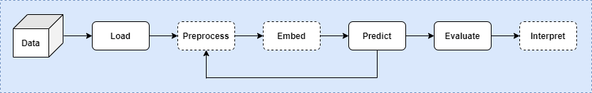

# Machine learning for medical imaging, graph/network, and computer vision



We aim to develop a library to accelerate **interdisciplinary** research on machine learning for medical imaging, graphs/networks, and computer vision. Our library will be complementary to existing libraries and beter facilitate **cross-disciplinary** collaborations. 

To join this effort, branch, clone or fork this repository and push your contributions when ready for review and merge. Follow [Google Python Style Guide](https://github.com/google/styleguide/blob/gh-pages/pyguide.md) and [Google Style Python Docstrings](https://sphinxcontrib-napoleon.readthedocs.io/en/latest/example_google.html) to make your code **well documented** and verify your API under `docs/` before requesting a merge.

## Workflow

* Minor update: direct update (for write access users)
* Major update:
  * Create a branch and document the update in detail in code
  * Update the `docs` to check documentations for the update
  * Merge (for write access users) and request a review
  * Reviewers: Raivo, Shuo, Haiping

## Overview

### Plan

* Early Oct 2020: First public release (for MICCAI20 paper), to discuss
* Long term: Satisfy the [requirements](https://pytorch.org/ecosystem/join) to join the [pytorch ecosysmtem](https://pytorch.org/ecosystem/)

### Objectives

* Share our resources/expertise and know each other better
* Build reusable+trustable tools for us first and the community next
* Avoid duplicated efforts and identify key missing components

### Principles

* Keep it **lean** in content, and memory/time cost. Quality first!
* Use existing top code when it fits (**credit@top + license**) and build when NA or we can do much better
* Keep it as modular as possible, following the pipeline below

### Pipeline-based modules

* `loaddata` load data from disk or online resources as in input
* `prepdata` preprocess data to fit machine learning modules below (transforms)
* `embed` embed data in a new space to learn a new representation (feature extraction/selection)
* `predict` predict a desired output
* `evaluate` evaluate the performance using some metrics
* `interpret` interpret the features and outputs via post-prediction analysis mainly via visualisation
* `pipeline` specify a machine learning workflow by combining several other modules

We need to design these core modules to be generic, reusable, customizable, and not specific to a particular dataset. 

### Dataset-specific modules

* `examples`: Real-application on particular datasets, with notebooks, GUI applications, and [TorchScript](https://pytorch.org/docs/stable/jit.html) support.

## Coding

### Coding style

* Follow [Google Python Style Guide](https://github.com/google/styleguide/blob/gh-pages/pyguide.md)
* Include detailed docstrings in code for generating documentations, following the [Google Style Python Docstrings](https://sphinxcontrib-napoleon.readthedocs.io/en/latest/example_google.html)
* Configure learning systems using [YAML](https://en.wikipedia.org/wiki/YAML) following [YACS](https://github.com/rbgirshick/yacs). Example: [ISONet](https://github.com/HaozhiQi/ISONet)
* Use [PyTorch](https://pytorch.org/tutorials/) when possible. **Highly recommend** [PyTorch Lightning](https://towardsdatascience.com/from-pytorch-to-pytorch-lightning-a-gentle-introduction-b371b7caaf09) ([Video](https://www.youtube.com/watch?v=QHww1JH7IDU))
* Key references include [MONAI](https://github.com/Project-MONAI/MONAI) for `medim`, [pytorch_geometric](https://github.com/rusty1s/pytorch_geometric) for `graph`, and [kornia](https://github.com/kornia/kornia) for `vision`.
* Repository structure

```
├───docs
├───examples
│   ├───cifar
│   │   ├───configs
│   │   ├───data
│   │   └───outputs
│   ├───cora
│   └───future
│       └───abidenyu
├───kale
│   ├───embed
│   ├───evaluate
│   ├───interpret
│   ├───loaddata
│   ├───pipeline
│   ├───predict
│   ├───prepdata
│   └───utils
└───tests
    └───data
```

### Progress

* Shuo on medim
* Haiping vision - [ISONet](https://github.com/HaozhiQi/ISONet/tree/master/isonet) on CIFAR, [CDAN](https://github.com/thuml/CDAN) on Office-31 (next graph - Cora)

### General recommendation

* Python: pytorch, [Visual Studio Code](https://code.visualstudio.com/download), pycharm
* GitHub: GitHub Desktop, [UCL guidance](https://www.ucl.ac.uk/isd/services/research-it/research-software-development-tools/support-for-ucl-researchers-to-use-github)
* Check out and contribute to the [resources](Resources.md) (and specific resources under each domain)

Welcome contributions from expertnal members. If you have a recommendation, contact Haiping to consider.

## Domain specifics

### Medical imaging

* Data and tasks
  * Brain fMRI for diagnosis, neural decoding ([Data](https://github.com/cMadan/openMorph))
  * Cardiac MRI (CMRI) for diagnosis, prognosis ([Data](http://www.cardiacatlas.org/challenges/))
  * CMRI Landmark localisation
  * CMRI segmentation?
  * Data: [Medical Data for Machine Learning](https://github.com/beamandrew/medical-data)
* Recommended package
  * [MONAI](https://github.com/Project-MONAI/MONAI): deep learning-based healthcare imaging workflows, with great [highlights](https://docs.monai.io/en/latest/highlights.html)

### Graph/Network

* Data and tasks
  * [Knowledge graph](https://github.com/shaoxiongji/awesome-knowledge-graph) and user-item interactions for recommender systems
  * Biomedical knowledge graph for drug-drug interaction prediction
  * Data: [OGB](https://github.com/snap-stanford/ogb), [OpenBioLink](https://github.com/OpenBioLink/OpenBioLink), [Chemistry/Biology graphs](https://github.com/mufeili/DL4MolecularGraph#benchmark-and-dataset)
* Recommended package
  * [pytorch_geometric](https://github.com/rusty1s/pytorch_geometric): deep learning library for graphs

### Computer vision

* Data and tasks
  * Action recognition from [videos](https://www.di.ens.fr/~miech/datasetviz/): [Data at GitHub listing](https://github.com/jinwchoi/awesome-action-recognition)
  * Pose estimation from [images](https://www.simonwenkel.com/2018/12/09/Datasets-for-human-pose-estimation.html): [Data at GitHub listing](https://github.com/cbsudux/awesome-human-pose-estimation#datasets)
  * Image classification (baselines): [CVonline Image Databases (including video etc)](http://homepages.inf.ed.ac.uk/rbf/CVonline/Imagedbase.htm)
* Recommended package
  * [kornia](https://github.com/kornia/kornia): Computer Vision Library for PyTorch by the OpenCV team
