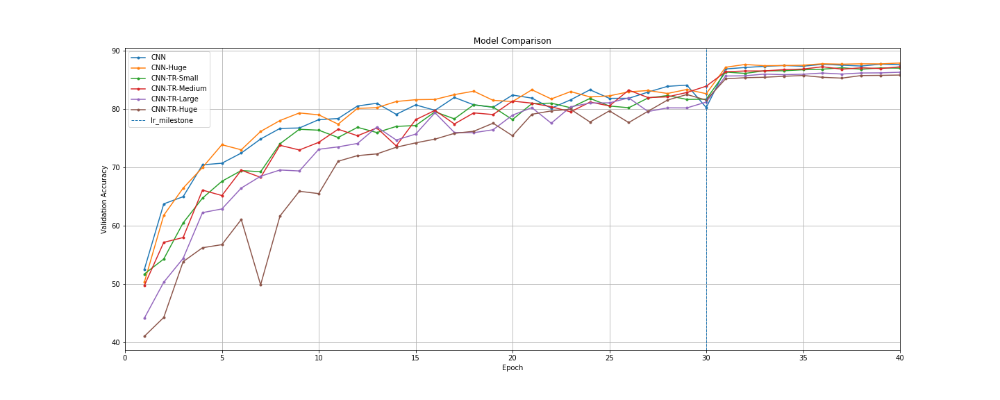

# Image Classification: Standard CNN vs. CNN+Attention

### 1. Description
In this example we train a standard 8 layer CNN on CIFAR10 as a baseline. We then take the same CNN architecture and stack a Transformer-Encoder ontop and train this new CNNTransformer model from scratch. We present several different variants of this model where we only alter the Transformer size. Below, the validation accuracy of each model is compared.

(The code example on this page does not aim to show any meaningful results, but only demonstrate the use of the CNNTransformer)

### 2. Observations
We observe that all models ultimately converge to a similar accuracy, only that the CNNTransformers learn slower which I think is likely because they use Dropout and the two base CNNs do not.

### 3. Usage
`python main.py --cfg configs/one_of_the_config_files.yaml`

### 4. Architecture
For clarity and as an example, below is the architecture of the CNNTransformer-Medium.

<pre>
---------------------------------------------------------------------------------------------------------
Layer (type:depth-idx)                                  Output Shape              Param #
=========================================================================================================
├─CNNTransformer: 1-1                                   [-1, 64, 8, 8]            --
|    └─SimpleCNN: 2-1                                   [-1, 64, 8, 8]            --
|    |    └─ModuleList: 3                               []                        --
|    |    |    └─Conv2d: 4-1                            [-1, 16, 32, 32]          448
|    |    |    └─BatchNorm2d: 4-2                       [-1, 16, 32, 32]          32
|    |    |    └─ReLU: 4-3                              [-1, 16, 32, 32]          --
|    |    |    └─MaxPool2d: 4-4                         [-1, 16, 16, 16]          --
|    |    |    └─Conv2d: 4-5                            [-1, 32, 16, 16]          4,640
|    |    |    └─BatchNorm2d: 4-6                       [-1, 32, 16, 16]          64
|    |    |    └─ReLU: 4-7                              [-1, 32, 16, 16]          --
|    |    |    └─Conv2d: 4-8                            [-1, 64, 16, 16]          18,496
|    |    |    └─BatchNorm2d: 4-9                       [-1, 64, 16, 16]          128
|    |    |    └─ReLU: 4-10                             [-1, 64, 16, 16]          --
|    |    |    └─Conv2d: 4-11                           [-1, 32, 16, 16]          2,080
|    |    |    └─BatchNorm2d: 4-12                      [-1, 32, 16, 16]          64
|    |    |    └─ReLU: 4-13                             [-1, 32, 16, 16]          --
|    |    |    └─MaxPool2d: 4-14                        [-1, 32, 8, 8]            --
|    |    |    └─Conv2d: 4-15                           [-1, 64, 8, 8]            18,496
|    |    |    └─BatchNorm2d: 4-16                      [-1, 64, 8, 8]            128
|    |    |    └─ReLU: 4-17                             [-1, 64, 8, 8]            --
|    |    |    └─Conv2d: 4-18                           [-1, 128, 8, 8]           73,856
|    |    |    └─BatchNorm2d: 4-19                      [-1, 128, 8, 8]           256
|    |    |    └─ReLU: 4-20                             [-1, 128, 8, 8]           --
|    |    |    └─Conv2d: 4-21                           [-1, 256, 8, 8]           295,168
|    |    |    └─BatchNorm2d: 4-22                      [-1, 256, 8, 8]           512
|    |    |    └─ReLU: 4-23                             [-1, 256, 8, 8]           --
|    |    |    └─Conv2d: 4-24                           [-1, 64, 8, 8]            16,448
|    |    |    └─BatchNorm2d: 4-25                      [-1, 64, 8, 8]            128
|    |    |    └─ReLU: 4-26                             [-1, 64, 8, 8]            --
|    └─Sequential: 2-2                                  [-1, 2, 64]               --
|    |    └─PositionalEncoding: 3-1                     [-1, 2, 64]               --
|    |    └─Dropout: 3-2                                [-1, 2, 64]               --
|    |    └─TransformerEncoder: 3-3                     [-1, 2, 64]               --
|    |    |    └─ModuleList: 4                          []                        --
|    |    |    |    └─TransformerEncoderLayer: 5-1      [-1, 2, 64]               --
|    |    |    |    |    └─MultiheadAttention: 6-1      [-1, 2, 64]               --
|    |    |    |    |    └─Dropout: 6-2                 [-1, 2, 64]               --
|    |    |    |    |    └─LayerNorm: 6-3               [-1, 2, 64]               128
|    |    |    |    |    └─Linear: 6-4                  [-1, 2, 128]              8,320
|    |    |    |    |    └─Dropout: 6-5                 [-1, 2, 128]              --
|    |    |    |    |    └─Linear: 6-6                  [-1, 2, 64]               8,256
|    |    |    |    |    └─Dropout: 6-7                 [-1, 2, 64]               --
|    |    |    |    |    └─LayerNorm: 6-8               [-1, 2, 64]               128
|    |    |    |    └─TransformerEncoderLayer: 5-2      [-1, 2, 64]               --
|    |    |    |    |    └─MultiheadAttention: 6-9      [-1, 2, 64]               --
|    |    |    |    |    └─Dropout: 6-10                [-1, 2, 64]               --
|    |    |    |    |    └─LayerNorm: 6-11              [-1, 2, 64]               128
|    |    |    |    |    └─Linear: 6-12                 [-1, 2, 128]              8,320
|    |    |    |    |    └─Dropout: 6-13                [-1, 2, 128]              --
|    |    |    |    |    └─Linear: 6-14                 [-1, 2, 64]               8,256
|    |    |    |    |    └─Dropout: 6-15                [-1, 2, 64]               --
|    |    |    |    |    └─LayerNorm: 6-16              [-1, 2, 64]               128
|    |    |    |    └─TransformerEncoderLayer: 5-3      [-1, 2, 64]               --
|    |    |    |    |    └─MultiheadAttention: 6-17     [-1, 2, 64]               --
|    |    |    |    |    └─Dropout: 6-18                [-1, 2, 64]               --
|    |    |    |    |    └─LayerNorm: 6-19              [-1, 2, 64]               128
|    |    |    |    |    └─Linear: 6-20                 [-1, 2, 128]              8,320
|    |    |    |    |    └─Dropout: 6-21                [-1, 2, 128]              --
|    |    |    |    |    └─Linear: 6-22                 [-1, 2, 64]               8,256
|    |    |    |    |    └─Dropout: 6-23                [-1, 2, 64]               --
|    |    |    |    |    └─LayerNorm: 6-24              [-1, 2, 64]               128
|    |    |    └─LayerNorm: 4-27                        [-1, 2, 64]               128
├─PredictionHead: 1-2                                   [-1, 10]                  --
|    └─AvgPool2d: 2-3                                   [-1, 64, 1, 1]            --
|    └─Linear: 2-4                                      [-1, 10]                  650
=========================================================================================================
Total params: 482,218
Trainable params: 482,218
Non-trainable params: 0
Total mult-adds (M): 34.04
---------------------------------------------------------------------------------------------------------
Input size (MB): 0.01
Forward/backward pass size (MB): 1.27
Params size (MB): 1.84
Estimated Total Size (MB): 3.12</pre>

(The only model that uses a different base CNN is CNN-TR-Huge. It uses CNN-Huge which is exactly the same but the last convolutional layer has 256 channels instead of 64)
