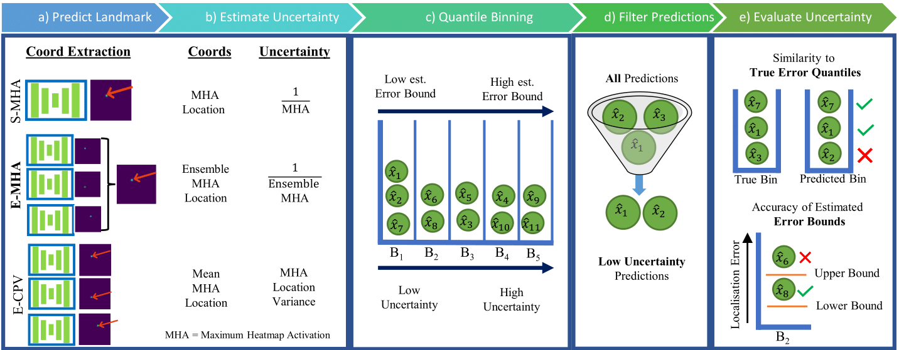

# Uncertainty Estimation in Landmark Localization

**IMPORTANT:** This is the clean branch of Pykale. Fully functional and reproducable code can be found on [this branch](https://github.com/pykale/pykale/tree/landmark_uncertainty/examples/landmark_uncertainty). It is not merged yet due to low test coverage.

## 1. Description

In this example we implement the methods from [Uncertainty Estimation for Heatmap-based Landmark Localization](placeholder_link). The method is Quantile Binning, which bins landmark predictions by any continuous uncertainty estimation measure. We assign each bin estimated localization error bounds. We can use these bins to filter out the worst predictions, or identify the likely best predictions.

We evaluate how well an uncertainty measure predicts localization error by measuring the [Jaccard Index](https://en.wikipedia.org/wiki/Jaccard_index) (a similarity measure) between the predicted bins and the ground truth error quantiles. We also evaluate the accuracy of the estimated error bounds. This framework is applicable to any dataset consisting of (*Continuous Uncertainty Measure*, *Continuous Evaluation Metric*) tuples.

Fig. 1 depicts the features exemplified in this example. Note that **a)** and **b)** are precomputed and provided in tabular form for this example.

||
|:--:|
| Fig. 1: Overview of our general Quantile Binning framework. **a)** We make a prediction using a heatmap-based landmark localization model, and **b)**  extract a continuous uncertainty measure. **c)**  We learn thresholds to categorize predictions into bins of increasing uncertainty, estimating error bounds for each bin. **e)**  We filter out predictions from high uncertainty bins to improve the proportion of acceptable predictions. **d)**  Finally, we evaluate each uncertainty measure's ability to capture the true error quantiles and the accuracy of the estimated error bounds.|

## 2. Datasets

We provide two datasets containing landmark localization error and uncertainty estimation values across 6 landmarks using 3 uncertainty estimation measures. The data is derived from a Cardiac Magnetic Resonance Imaging (CMR) landmark localization task, using data from the [ASPIRE Registry](https://erj.ersjournals.com/content/39/4/945). We have 303 Short Axis View (CMR) scans with 3 landmarks each, and 422 Four Chamber View CMR scans with 3 landmarks each. For each uncertainty measure we provide tuples of (*Continuous Uncertainty Measure*, *Continuous Localization Error*) for each sample in the validation and test set in tabular form. We have split the data into 8 folds and used cross validation to gather validation and test set uncertainty tuples for every sample in the datasets.

In this example, we compare the uncertainty measures:

- Single Maximum Heatmap Activation (S-MHA).
- Ensemble Maximum Heatmap Activation (E-MHA).
- Ensemble Coordinate Prediction Variance (E-CPV).

We compare these measures on landmark predictions from:

- A [U-Net model](https://link.springer.com/content/pdf/10.1007/978-3-319-24574-4_28.pdf).
- A [PHD-Net model](https://ieeexplore.ieee.org/document/9433895/).

## 3. Usage

Run Quantile Binning for the Four Chamber and Short Axis data respectively:

```bash
python main.py --cfg configs/4CH_data.yaml
python main.py --cfg configs/SA_data.yaml
```
